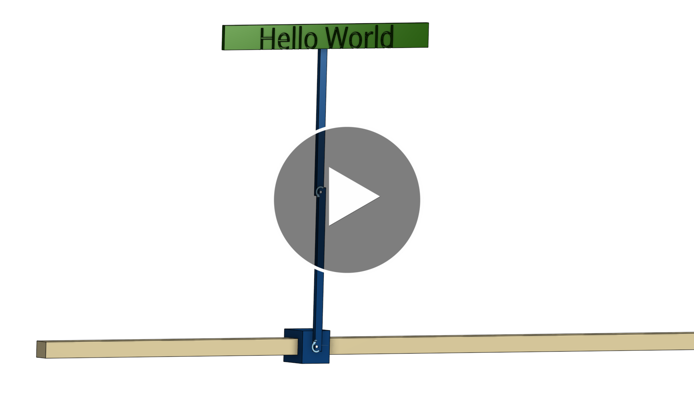

# Double Pendulum Isaac Lab - Reinforcement Learning Training

A complete implementation of an inverted double pendulum control system trained using reinforcement learning in NVIDIA Isaac Lab. This project demonstrates how to build a complex underactuated system (controlling two passive pendulum arms with only a single cart actuator) and train a policy to balance it in the unstable upright position.

> **Inspiration**: This project was inspired by the fantastic [LycheeAI video](https://www.youtube.com/watch?v=7bPfUcXKaQk&t=10s).

I wanted to take it one step further and implemented it for an inverted double pendulum, with a small sign attached to it.

## Watch the Demo!

<a href="https://www.youtube.com/watch?v=hYR54jUqfW0" target="_blank">
  
</a>

## Overview

The inverted double pendulum is a classic control problem that challenges traditional control methods. This project uses deep reinforcement learning (PPO) to learn a policy that can balance both pendulum arms upright by controlling only the horizontal force on the cart.

**System Components:**
- A **rail** (fixed base)
- A **cart** that slides along the rail (controlled by the RL agent)
- A **first arm** attached to the cart (passive joint, free to rotate)
- A **second arm** attached to the first arm (passive joint, free to rotate)

The RL agent controls only the cart's horizontal force and must learn to balance both pendulum arms in the upright position (unstable equilibrium).

## Reinforcement Learning Setup

### Action Space
- **1D continuous**: Horizontal force on cart (scaled to ±100N, clamped at ±400N)

### Observation Space
- **6D vector**: 
  - Cart position (m)
  - First arm angle (rad)
  - Second arm angle (rad)
  - Cart velocity (m/s)
  - First arm angular velocity (rad/s)
  - Second arm angular velocity (rad/s)

### Reward Function
The reward function encourages balancing both arms upright while maintaining smooth, controlled motion:

- **Primary Task Rewards**: 
  - L2 penalty for arm deviations from upright (-1.5 weight each)
  - Exponential bonus for staying upright (+2.0 weight)
- **Shaping Rewards**: 
  - Penalties for high angular velocities (-0.005 weight each arm)
  - Penalty for high cart velocity (-0.01 weight)

### Training Configuration
- **Algorithm**: PPO (Proximal Policy Optimization)
- **Parallel Environments**: 4096
- **Episode Length**: 10 seconds
- **Control Frequency**: 60 Hz (120 Hz simulation, decimation=2)
- **Event Randomization**: Initial cart position, arm angles, and velocities randomized at episode start

## Project Structure

```
DoublePendulumIsaacLab/
├── DoublePendulumURDF/          # Robot URDF and assets
│   ├── robot.urdf               # Main robot description
│   └── assets/                  # STL files and parts
├── DoublePendulumTraining/      # RL training project
│   ├── source/                  # Python package source
│   ├── scripts/                 # Training and evaluation scripts
│   └── best_agent.pt            # Pre-trained policy
├── How_to/                      # Documentation
│   ├── how_to_install_isaac_sim_and_lab.md
│   └── how_to_build_and_train_pendulum.md
└── README.md                    # This file
```

## Installation and Documentation

For detailed instructions on:
- **Installing Isaac Sim/Lab**: See [`How_to/how_to_install_isaac_sim_and_lab.md`](How_to/how_to_install_isaac_sim_and_lab.md)
- **Building and training the robot**: See [`How_to/how_to_build_and_train_pendulum.md`](How_to/how_to_build_and_train_pendulum.md)


## Project Goals

This project was created to:
- Demonstrate end-to-end RL training in Isaac Lab (from CAD to trained policy)
- Provide a complete, well-documented example for learning Isaac Lab

## Future Improvements

- Deploy to physical hardware

